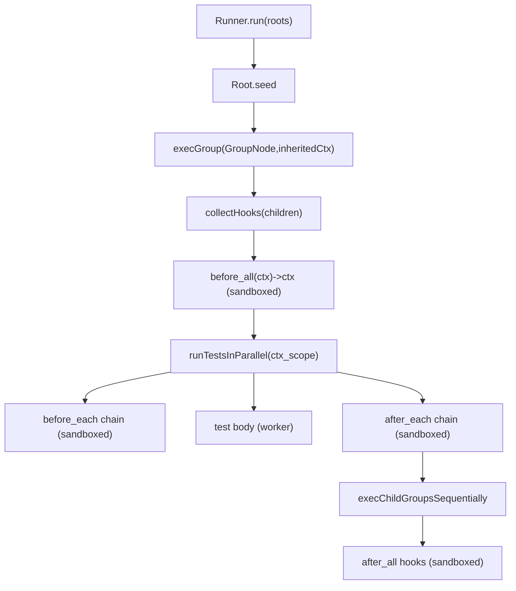

# Dream Test v2 Unified Node Runner Plan

## Goals (v2.0 cleanup)

- Replace existing suite/hook execution model with a **single, coherent tree model** where **everything is a node**.
- Support **context seed as a value (root only)** and allow **`before_all` / `before_each` transformers at any group level**.
- Sandbox **all hooks** (before/after, all scopes) using the runner’s existing `default_timeout_ms`.
- Keep execution model: **parallel tests, sequential groups**.
- Add `dream_test/unit_context` (root takes a seed value) while keeping `dream_test/unit` as the no-context DSL.
- Support **tagging on describe/group** and **propagate tags** to all descendant tests.
- Preserve public Gherkin API surface as much as possible, but make its implementation compile down to the same Node execution engine.
- Remove legacy complexity: delete `describe_with_hooks` / `SuiteHooks` and any now-obsolete types/paths.

## Non-goals

- No publishing commands.
- No new runner configuration surface (hook timeout uses existing `default_timeout_ms`).
- No parallel execution of groups (keeps reporter output deterministic).

## High-level architecture

### New core tree model

Create a new core representation that the runner executes.

- **Root** carries seed + root node:
```gleam
pub type Root(ctx) {
  Root(seed: ctx, tree: Node(ctx))
}
```

- **Everything is a node**:
```gleam
pub type Node(ctx) {
  Group(name: String, tags: List(String), children: List(Node(ctx)))

  Test(
    name: String,
    tags: List(String),
    kind: TestKind,
    run: fn(ctx) -> Result(AssertionResult, String),
    timeout_ms: Option(Int),
  )

  BeforeAll(fn(ctx) -> Result(ctx, String))
  BeforeEach(fn(ctx) -> Result(ctx, String))
  AfterEach(fn(ctx) -> Result(Nil, String))
  AfterAll(fn(ctx) -> Result(Nil, String))
}
```


### Hook collection rule (position-independent)

Within a `Group`, hook nodes apply to the group **regardless of where they appear in `children`**.

- Hook execution order within a group is still the order they appear (stable).
- This prevents “hooks only affect later siblings” surprises.

### Tag propagation rule

Effective test tags are:

- `group/suite tags` (root → leaf) + `test tags`
- **Stable order, de-duplicated** (first occurrence wins)

### Execution flow (parallel tests, sequential groups)

For each group scope, we compute a scope context once, then run tests in that scope in parallel, then recurse into subgroups sequentially.



### Reporter events

Emit the existing event types from `dream_test/reporter/types` consistently:

- `HookStarted/HookFinished` for every hook invocation
  - `scope`: `List(String)` describing the group path
  - `test_name`: `None` for before_all/after_all, `Some(name)` for per-test hooks
- `TestFinished` for each test result

## Public API: Unit DSL modules

### `dream_test/unit` (no context)

- `describe(name, children)` produces `Root(Nil)`.
- Tests and hooks are **0-arg** for clean ergonomics.

Full example (unqualified imports):

```gleam
import dream_test/assertions/should.{equal, or_fail_with, should}
import dream_test/reporter/api as reporter
import dream_test/runner
import dream_test/unit.{before_all, before_each, describe, it, with_tags}
import gleam/io

fn start_server() -> Result(Nil, String) { Ok(Nil) }
fn warm_cache() -> Result(Nil, String) { Ok(Nil) }
fn clear_fixtures() -> Result(Nil, String) { Ok(Nil) }

pub fn tests() {
  describe("HTTP", [
    before_all(fn() {
      use _ <- start_server()
      warm_cache()
    }),
    before_each(fn() { clear_fixtures() }),
    it("responds", fn() {
      "ok"
      |> should()
      |> equal("ok")
      |> or_fail_with("should respond ok")
    })
      |> with_tags(["smoke"]),
  ])
  |> with_tags(["integration"])
}

pub fn main() {
  runner.new([tests()])
  |> runner.reporter(reporter.bdd(io.print, True))
  |> runner.exit_on_failure()
  |> runner.run()
}
```

### `dream_test/unit_context` (seed value + ctx transformers)

- `describe(name, seed, children)` produces `Root(ctx)`.
- `before_all`/`before_each` are **ctx → ctx** transformers.
- Nested groups may contain `before_all`/`before_each` as well.

Full example:

```gleam
import dream_test/assertions/should.{equal, or_fail_with, should}
import dream_test/unit_context.{before_all, describe, group, it, with_tags}

pub type Ctx {
  Ctx(port: Int, role: String)
}

fn start_server(_port: Int) -> Result(Int, String) { Ok(3000) }

pub fn tests() {
  describe("App", Ctx(port: 0, role: ""), [
    before_all(fn(ctx) {
      use port <- start_server(0)
      Ok(Ctx(..ctx, port: port))
    }),

    group("Admin", [
      before_all(fn(ctx) { Ok(Ctx(..ctx, role: "admin")) }),
      it("sees role", fn(ctx) {
        ctx.role
        |> should()
        |> equal("admin")
        |> or_fail_with("role should be admin")
      }),
    ])
      |> with_tags(["rbac"]),
  ])
  |> with_tags(["integration"])
}
```

## Runner changes

### `dream_test/runner`

- Change `runner.new(...)` to accept `List(Root(ctx))` instead of `List(TestSuite(ctx))`.
- Keep builder functions and reporters unchanged in surface area.

### `dream_test/parallel`

- Replace current “root-only before_all producer” execution with the unified Node engine:
  - Compute scope context via sandboxed hook chains.
  - Run tests in parallel in workers.
  - Recurse groups sequentially.
  - Execute after_all hooks sandboxed.
- Preserve deterministic result ordering via existing indexing strategy.

### `dream_test/sandbox`

- Add a sandbox helper for hooks that return `Result(a, String)`.
- Use `default_timeout_ms` for hook timeouts.
- Keep existing crash-report suppression behavior.

## Gherkin consistency (preserve public API)

- Keep public modules/functions under `[src/dream_test/gherkin/]( /Users/dcrockwell/Documents/Code/TrustBound/dream_test/src/dream_test/gherkin/)` as stable as possible.
- Internally, rewrite conversions so Gherkin suites produce `Root(ctx)` + `Node(ctx)` trees.
- Represent “scenario context” as a single record passed to step handlers and scenario tests.
- Ensure tags on features/scenarios propagate into resulting tests via the same tag mechanism.

## Removal of legacy APIs

- Delete `describe_with_hooks` and `SuiteHooks` from `[src/dream_test/unit.gleam]( /Users/dcrockwell/Documents/Code/TrustBound/dream_test/src/dream_test/unit.gleam)`.
- Remove any runner/parallel code paths and types that assumed `before_all: Option(fn() -> Result(ctx, String))`.
- Update docs and release notes to reference only `unit` and `unit_context`.

## Documentation updates

- Update `[releases/release-2.0.0.md]( /Users/dcrockwell/Documents/Code/TrustBound/dream_test/releases/release-2.0.0.md)` migration guide to:
  - Explain the new Node model at a high level.
  - Provide complete, copy/paste-able examples for `unit` and `unit_context` (as above).
  - Clearly document hook semantics (outer→inner before hooks; inner→outer after hooks; position-independent within a group).
  - Document tag propagation.
- Update `[CHANGELOG.md]( /Users/dcrockwell/Documents/Code/TrustBound/dream_test/CHANGELOG.md)` 2.0.0 section to reflect the final API names and behavior.

## Validation

- Ensure `make all` passes (library tests + examples).
- Add/adjust tests to cover:
  - nested group `before_all` execution (once per scope)
  - hook sandboxing (crash/timeout handling)
  - tag propagation (suite/group/test)
  - deterministic ordering with sequential groups
  - gherkin conversion produces identical behavior using the unified runner

## Rollout order (implementation sequence)

1. Introduce `Root/Node` core types in `[src/dream_test/types.gleam]( /Users/dcrockwell/Documents/Code/TrustBound/dream_test/src/dream_test/types.gleam)`.
2. Implement sandboxed hook execution helper in `[src/dream_test/sandbox.gleam]( /Users/dcrockwell/Documents/Code/TrustBound/dream_test/src/dream_test/sandbox.gleam)`.
3. Rewrite parallel runner to execute `Root/Node` trees.
4. Rewrite `unit` to build `Root(Nil)` + nodes, including `with_tags`.
5. Add `unit_context` to build `Root(ctx)` + nodes.
6. Rebuild gherkin to emit `Root/Node` while preserving public surface.
7. Delete legacy APIs and update docs.
8. Run `make all` and iterate on failures.